# feishu-create-doc

创建飞书云文档。从 Lark-flavored Markdown 内容创建新的飞书云文档，支持指定创建位置（文件夹/知识库/知识空间）。

## 概述

通过 MCP 调用 `create-doc`，从 Lark-flavored Markdown 内容创建一个新的飞书云文档。

## 返回值

工具成功执行后，返回一个 JSON 对象，包含以下字段：
- **`doc_id`**（string）：文档的唯一标识符（token），格式如 `doxcnXXXXXXXXXXXXXXXXXXX`
- **`doc_url`**（string）：文档的访问链接，可直接在浏览器中打开，格式如 `https://www.feishu.cn/docx/doxcnXXXXXXXXXXXXXXXXXXX`
- **`message`**（string）：操作结果消息，如"文档创建成功"

## 参数

### markdown（必填）

文档的 Markdown 内容，使用 **Lark-flavored Markdown** 格式。

调用本工具的 markdown 内容应当尽量结构清晰,样式丰富, 有很高的可读性. 合理的使用 callout 高亮块, 分栏,表格等能力,并合理的运用插入图片与 mermaid 的能力,做到图文并茂..

**编写原则**:
- **结构清晰**：标题层级 ≤ 4 层，用 Callout 突出关键信息
- **视觉节奏**：用分割线、分栏、表格打破大段纯文字
- **图文交融**：流程和架构优先用 Mermaid/PlantUML 可视化
- **克制留白**：Callout 不过度、加粗只强调核心词

**重要提示**：
- **禁止重复标题**：markdown 内容开头不要写与 title 相同的一级标题！title 参数已经是文档标题，markdown 应直接从正文内容开始
- **目录**：飞书自动生成，无需手动添加
- Markdown 语法必须符合 Lark-flavored Markdown 规范

### title（可选）

文档标题。

### folder_token（可选）

父文件夹的 token。如果不提供，文档将创建在用户的个人空间根目录。

folder_token 可以从飞书文件夹 URL 中获取，格式如：`https://xxx.feishu.cn/drive/folder/fldcnXXXX`，其中 `fldcnXXXX` 即为 folder_token。

### wiki_node（可选）

知识库节点 token 或 URL（可选，传入则在该节点下创建文档，与 folder_token 和 wiki_space 互斥）

wiki_node 可以从飞书知识库页面 URL 中获取，格式如：`https://xxx.feishu.cn/wiki/wikcnXXXX`，其中 `wikcnXXXX` 即为 wiki_node token。

### wiki_space（可选）

知识空间 ID（可选，传入则在该空间根目录下创建文档。特殊值 `my_library` 表示用户的个人知识库。与 wiki_node 和 folder_token 互斥）

wiki_space 可以从知识空间设置页面 URL 中获取，格式如：`https://xxx.feishu.cn/wiki/settings/7448000000000009300`，其中 `7448000000000009300` 即为 wiki_space ID。

**参数优先级**：wiki_node > wiki_space > folder_token

---

## Lark-flavored Markdown 完整语法指南

### 基础块类型

#### 文本（段落）
```markdown
普通文本段落
段落中的**粗体文字**
多个段落之间用空行分隔。

居中文本 {align="center"}
右对齐文本 {align="right"}
```

#### 标题
```markdown
# 一级标题
## 二级标题
### 三级标题
#### 四级标题

# 带颜色的标题 {color="blue"}
## 红色标题 {color="red"}
# 居中标题 {align="center"}
```

**颜色值**：red, orange, yellow, green, blue, purple, gray

#### 列表
```markdown
- 无序项1
  - 无序项1.a
  - 无序项1.b
1. 有序项1
2. 有序项2
- [ ] 待办
- [x] 已完成
```

#### 引用块
```markdown
> 这是一段引用
> 可以跨多行
> 引用中支持**加粗**和*斜体*等格式
```

#### 代码块
````markdown
```python
print("Hello")
```
````

支持语言：python, javascript, go, java, sql, json, yaml, shell 等。

#### 分割线
```markdown
---
```

---

### 富文本格式

| 格式 | 语法 |
|------|------|
| 粗体 | `**粗体**` |
| 斜体 | `*斜体*` |
| 删除线 | `~~删除线~~` |
| 行内代码 | `` `代码` `` |
| 下划线 | `<u>下划线</u>` |
| 红色文字 | `<text color="red">红色</text>` |
| 黄色背景 | `<text background-color="yellow">高亮</text>` |
| 链接 | `[链接文字](https://example.com)` |
| 行内公式 | `$E = mc^2$` 或 `<equation>E = mc^2</equation>` |

---

### 高级块类型

#### 高亮块（Callout）
```html
<callout emoji="✅" background-color="light-green" border-color="green">
支持**格式化**的内容
</callout>
```

**背景色选项**：
- light-red / red
- light-blue / blue（提示 💡）
- light-green / green（成功 ✅）
- light-yellow / yellow（警告 ⚠️）
- light-orange / orange
- light-purple / purple
- pale-gray / light-gray / dark-gray

**⚠️ Callout 限制**：内部仅支持文本、标题、列表、待办、引用。不支持表格、代码块、嵌套 Callout、Grid 分栏、图片。

#### 分栏（Grid）
```html
<grid cols="2">
  <column>左栏内容</column>
  <column>右栏内容</column>
</grid>
```

**自定义宽度**：
```html
<grid cols="3">
  <column width="20">左栏(20%)</column>
  <column width="60">中栏(60%)</column>
  <column width="20">右栏(20%)</column>
</grid>
```

#### 表格

**标准 Markdown 表格**：
```markdown
| 列 1 | 列 2 | 列 3 |
|------|------|------|
| A | B | C |
| D | E | F |
```

**飞书增强表格**（支持复杂内容）：
```html
<lark-table column-widths="200,250,280" header-row="true">
  <lark-tr>
    <lark-td>
      **表头1**
    </lark-td>
    <lark-td>
      **表头2**
    </lark-td>
  </lark-tr>
  <lark-tr>
    <lark-td>
      内容1
    </lark-td>
    <lark-td>
      内容2
    </lark-td>
  </lark-tr>
</lark-table>
```

#### 图片
```html
<image url="https://example.com/image.png" width="800" height="600" align="center" caption="图片描述"/>
```

**⚠️ 重要**：只支持 URL 方式，系统会自动下载并上传到飞书。

#### 文件
```html
<file url="https://example.com/document.pdf" name="文档.pdf" view-type="1"/>
```

#### 画板（Mermaid / PlantUML 图表）

**Mermaid 流程图**（推荐）：
````markdown
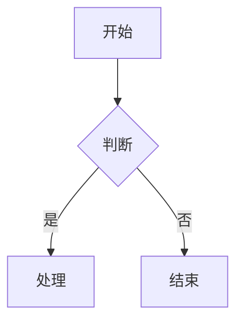
````

**支持图表类型**：flowchart, sequenceDiagram, classDiagram, stateDiagram, gantt, mindmap, erDiagram, pie, timeline

**PlantUML**：
````markdown
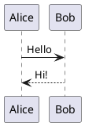
````

---

### 181种画板图表库（顶级咨询公司模板）

#### 战略分析类

**波士顿矩阵 (BCG Matrix)**：
````markdown
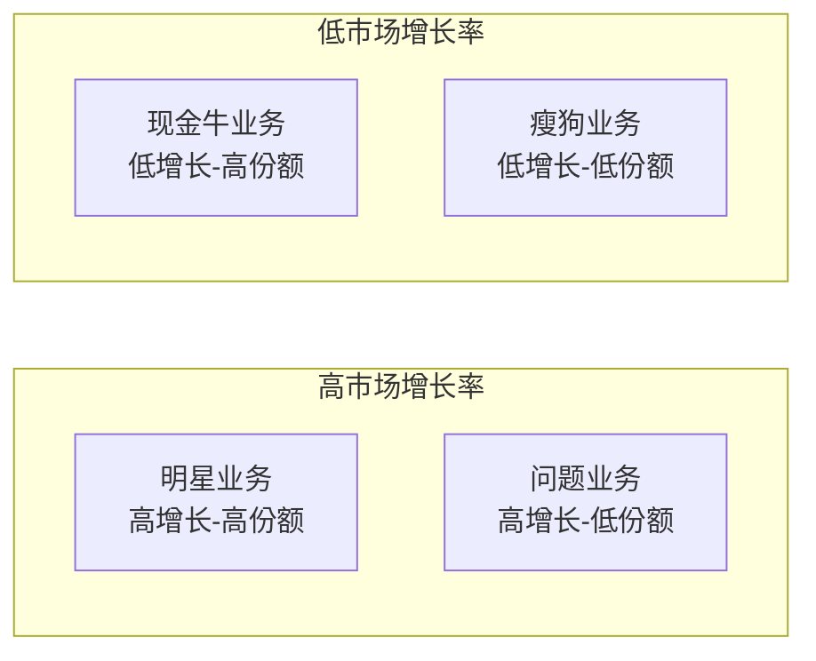
````

**SWOT分析**：
````markdown
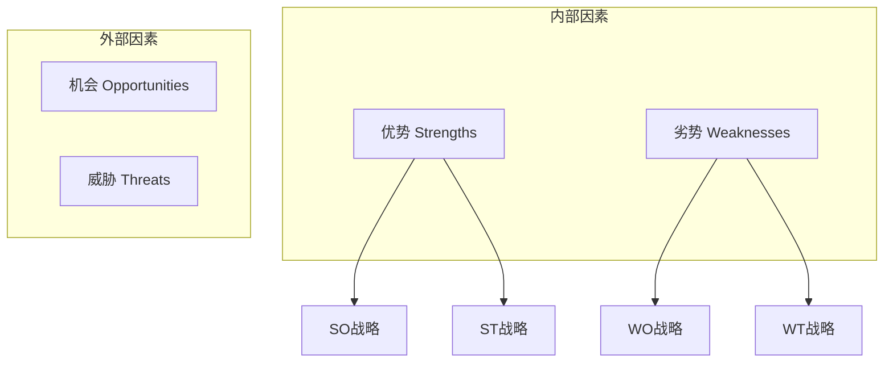
````

**安索夫矩阵**：
````markdown
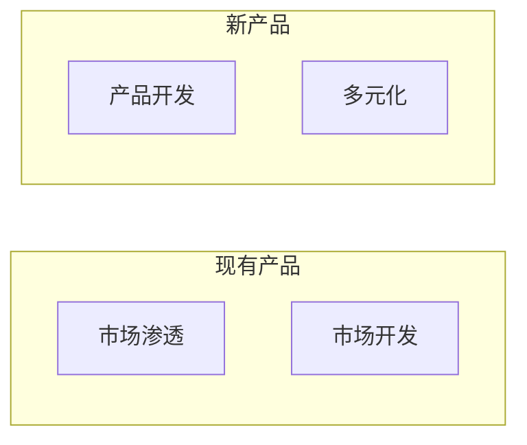
````

#### 流程建模类

**SIPOC模型**：
````markdown

````

**PDCA循环**：
````markdown
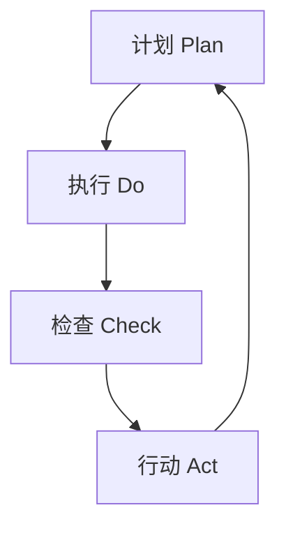
````

#### 组织管理类

**麦肯锡7S模型**：
````markdown
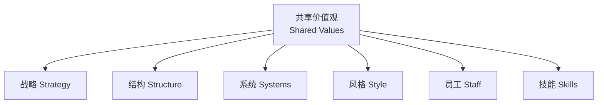
````

#### 项目管理类

**WBS工作分解**：
````markdown
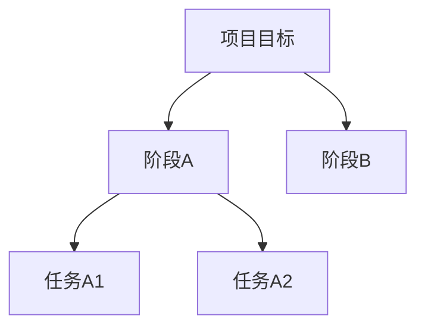
````

**甘特图**：
````markdown
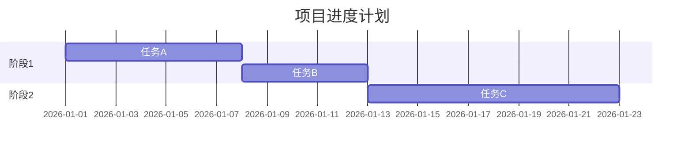
````

#### 营销销售类

**AARRR漏斗**：
````markdown
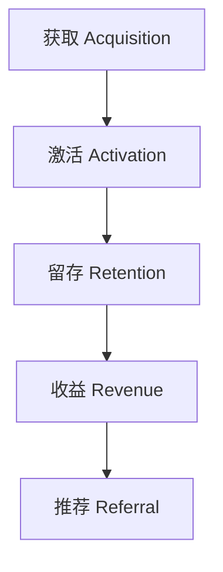
````

#### 其他

**思维导图**：
````markdown
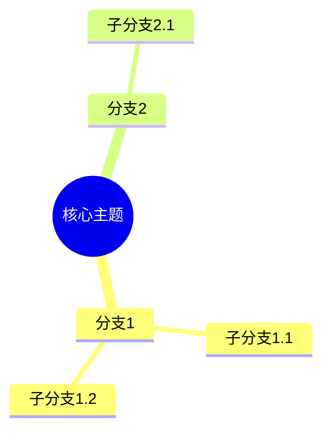
````

**时序图**：
````markdown
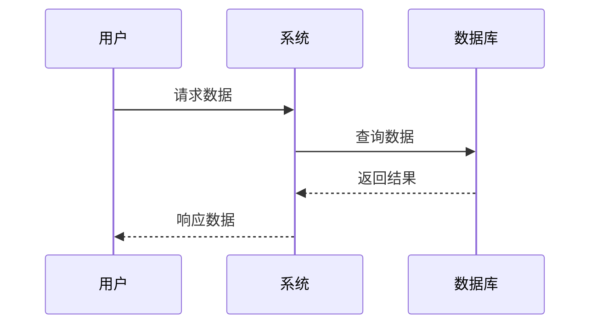
````

---

### 颜色编码系统（架构图规范）

| 组件类型 | 颜色 | 用途 |
|---------|------|------|
| 输入/输出 | `#3498db` 🟦 | 数据入口和出口 |
| 处理节点 | `#f39c12` 🟨 | 转换和处理逻辑 |
| 决策点 | `#e74c3c` 🟥 | 条件判断、分支 |
| 存储 | `#27ae60` 🟩 | 数据库、文件、缓存 |
| 融合/排序 | `#9b59b6` 🟪 | 多路合并、精排 |
| 外部服务 | `#2c3e50` ⬛ | 第三方依赖 |

**使用示例**：
````markdown
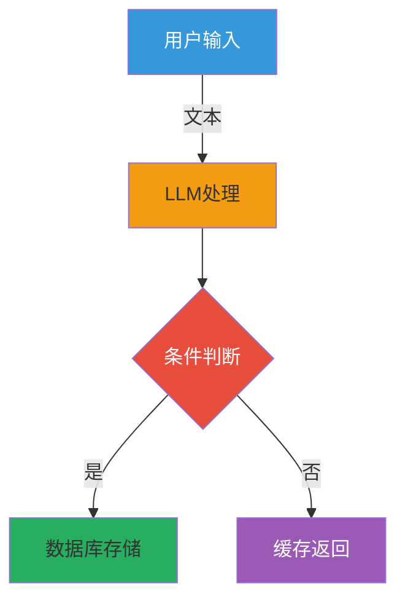
````

---

## 使用示例

### 示例 1：创建简单文档
```json
{
  "title": "项目计划",
  "markdown": "# 项目概述\n\n这是一个新项目。\n\n## 目标\n\n- 目标 1\n- 目标 2"
}
```

### 示例 2：创建到指定文件夹
```json
{
  "title": "会议纪要",
  "folder_token": "fldcnXXXXXXXXXXXXXXXXXXXXXX",
  "markdown": "# 周会 2025-01-15\n\n## 讨论议题\n\n1. 项目进度\n2. 下周计划"
}
```

### 示例 3：使用飞书扩展语法
```json
{
  "title": "产品需求",
  "markdown": "<callout emoji=\"💡\" background-color=\"light-blue\">\n重要需求说明\n</callout>\n\n## 功能列表\n\n| 功能 | 优先级 |\n|------|--------|\n| 登录 | P0 |\n| 导出 | P1 |"
}
```

### 示例 4：创建到知识库
```json
{
  "title": "技术文档",
  "wiki_node": "wikcnXXXXXXXXXXXXXXXXXXXXXX",
  "markdown": "# API 接口说明\n\n这是一个知识库文档。"
}
```

---

## 最佳实践

- **空行分隔**：不同块类型之间用空行分隔
- **转义字符**：特殊字符用 `\` 转义：`\*` `\~` `` \` ``
- **图片**：使用公开可访问的 URL，系统自动下载上传
- **分栏**：列宽总和必须为 100
- **表格选择**：简单数据用 Markdown，复杂嵌套用 `<lark-table>`
- **提及用户**：@用户用 `<mention-user id="ou_xxx"/>`，需先 search-user 获取 ID
- **目录**：飞书自动生成，无需手动添加
- **长文档**：分段创建，先用 create-doc 创建框架，再用 update-doc append 模式追加

---

## ⚠️ 重要注意事项

### Callout 高亮块限制
Callout 内部**不支持**：表格、代码块、嵌套 Callout、Grid 分栏、图片。

### 画板创建与读取
- **创建时**：使用 Mermaid/PlantUML 代码块
- **读取时**：返回 `<whiteboard token="xxx"/>`，无法获取原始源码
- **更新时**：无法直接修改，需替换为新代码块

### 图片/文件
- 创建时使用 URL，读取时返回 token
- 读取返回的 token 无法原样用于创建

### 多维表格/电子表格
只能创建空表，创建后使用对应 API 写入数据。
